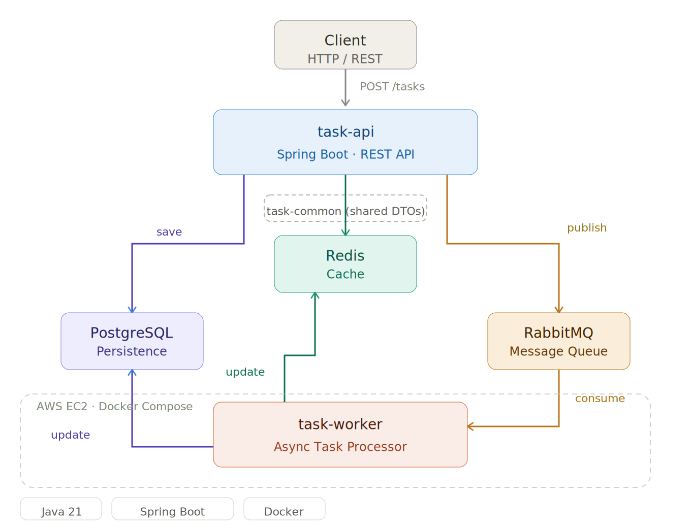

# Task System

A distributed task processing system built with microservices architecture.

## Architecture


- **task-api** — REST API built with Spring Boot
- **task-worker** — Async task processor consuming RabbitMQ messages  
- **task-common** — Shared DTOs and entities

## Tech Stack
- Java 21 + Spring Boot
- PostgreSQL (persistence)
- Redis (caching)
- RabbitMQ (message queue)
- Docker + Docker Compose
- AWS EC2 (deployment)

## How to run locally
```bash
cd infrastructure
docker compose up --build -d
```

## API Endpoints
| Method | Endpoint | Description |
|--------|----------|-------------|
| POST | /tasks | Create a new task |
| GET | /tasks/{id} | Get task by ID |

## Flow
1. Client sends POST /tasks
2. API saves task to PostgreSQL
3. API caches task in Redis
4. API publishes message to RabbitMQ
5. Worker picks up message and processes task
6. Worker updates status in DB and Redis